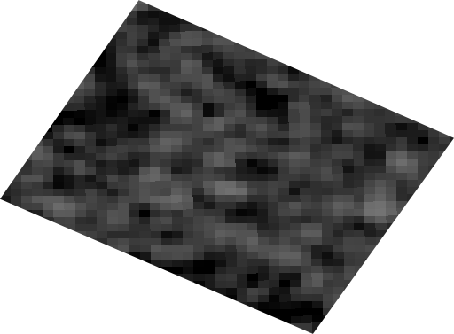
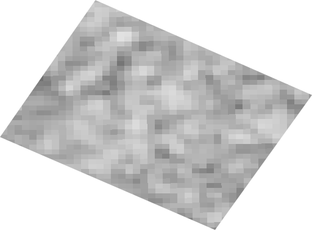
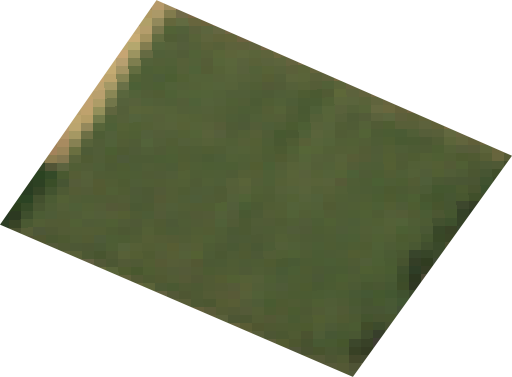
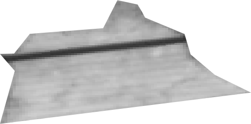

# PMI_detection_TillageLabour
This is the git that store the PMI detection Tillage Labour

Author :
- LEGRAND Aymeric
- SAMYN Bérérnice
- SORHAINDO Léa
- VINATIER Mathys

___

The purpose of this project is to use Satellite imagery (Sentinel-1 & Sentinel-2) to detect and estimate impacts of the tillage effect on fields.

## [Datasets folder](Datasets/) :
[Datasets](Datasets/) is an importable folder where you will find tools such as :
- **extract_sentinel1** & **extract_sentinel_2** : Tools that allows you to scrap VV, VH and NDVI images for a given ROI Polygon, range of dates and day step.
- **dataframe_sentinel1** & **dataframe_sentinel2** : Tools that allows you to return dataframe from images saved by the previous tool it will return this kind of DataFrame :

| Date       | NDVI      | VV         | VH        | CR        |
|------------|-----------|------------|-----------|-----------|
| 2018-01-13 | 48.656635 | 190.601148 | 76.114637 | 2.504133  |
| 2018-01-14 | 48.656635 | 201.665069 | 78.930706 | 2.554963  |
| 2018-02-10 | 1.767717  | 190.990162 | 62.108662 | 3.075097  |
| 2018-02-24 | 43.107995 | 129.782180 | 10.494550 | 12.366626 |
| 2018-02-25 | 43.107995 | 112.689836 | 8.888889  | 12.677606 |

*Example of uses* : (you will finf file that uses it in this [analysis](Analysis_NDVI_VV_VH/analysis_on_NDVI_VV_VH.ipynb))
```python

from Datasets import *

your_gee_project = "ee-MyProject"
roi_name         = "Catillon"

time_start = (1,1,2018)
time_stop  = (1,1,2019)
day_step   = 15

# Create object of your GEE project
data_sent1 = extract_sentinel1(catillon_roi, roi_name, your_gee_project)
data_sent2 = extract_sentinel2(catillon_roi, roi_name, your_gee_project)

# Save Images
data_sent1.save(time_start, time_stop, day_step, is_vv=True, is_vh=False)
data_sent2.save(time_start, time_stop, day_step, is_RGB = False, is_NDVI = True)

# Create DataFrame based on the scrapped images
sentinelOne2df("./Sentinel2_Images_Catillon/2018").make_df()
sentinelTwo2df("./Sentinel2_Images_Catillon/2018").make_df()

```


## Analysis folders :

- [Analysis_NDVI_VV_VH](Analysis_NDVI_VV_VH) :
    - [analysis_on_NDVI_VV_VH](Analysis_NDVI_VV_VH/analysis_on_NDVI_VV_VH.ipynb) : Is the Jupyter Notebook that contains all the information about the K-means clusters and RandomForest predictions.
    - [analysis_crop](Analysis_NDVI_VV_VH/analysis_crop.ipynb) : Is the feature Analytic Jupyter Notebook where we study VV, VH and NDVI on a cropland image.

- [Analysis_TillageReport](Analysis_TillageReport) :
    - [Sentinel1_TillageStudy](Analysis_TillageReport/Sentinel1_TillageStudy.ipynb) : Is redoing a study already done in order to start understanding the VV and VH principles


## SentinelXX folders

These folders are refering to all the scrapped images that has been exported from the extract_sentinelX tools. We will find different images formatted this way *Sentinel[X]_Images_[ROI]/[year]/[dd]_[mm]_[yy]_[BandWidth].png*

<p align="left">
    
    
    
    
</p>
<p align="left">
  <b>Image VH</b> &nbsp;&nbsp;&nbsp;&nbsp;
  <b>Image VV</b> &nbsp;&nbsp;&nbsp;&nbsp;
  <b>Image RGB</b> &nbsp;&nbsp;&nbsp;&nbsp;
  <b>Image NEDVI</b>
</p>
